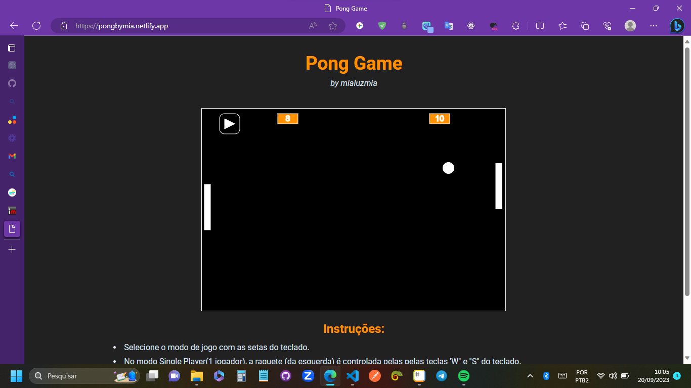

# Projeto Pong Clone
Olá! Esse projeto é uma réplica do jogo clássico "Pong" usando javascript.

[Link para o site](https://pongbymia.netlify.app/)

# Tecnologias usadas no projeto

O projeto foi desenvolvido com as seguintes tecnologias:

- [x] **Javascript, HTML, CSS** - Tecnologias base do projeto.
- [x]  **p5.js** - Biblioteca que facilita a manipulação de canvas,  o jogo se baseia nessa biblioteca.
- [x] **p5.collide2D.** - biblioteca que disponibiliza métodos pra identificar colisão de obejtos 2d na p5.js, usada pra reconhecer a colisão das raquetes com a bolinha.
- [x] **p5.sound**- biblioteca que permite adcionar sons na p5.js.
- [x] **Netlify** - onde foi hospedado o projeto

 
# Como rodar o projeto localmente
- [ ] **Faça o fork do projeto** 
- [ ] **Clone ele na sua máquina** 
- [ ]  **abra um servidor local** - para o jogo funcionar localmente ele precisa estar em um servidor local. Se você usa o VS code recomendo a extensão "Live Preview", tentei fazer host com o http-server e com o live server, porém por algum motivo não funcionaram com o p5.js.
- [ ]  **Agora você pode rodar o projeto e fazer as alterações que desejar :)**

# Me encontre nesses lugares

Ficou interessado no projeto, tem alguma dúvida ou quer colaborar com ele? Se conecte comigo nessas redes:

- [E-mail](mialuzazevedo@gmail.com)
- [LinkedIn](https://www.linkedin.com/in/mialuzmia/)
- [GitHub](https://github.com/mialuzmia)